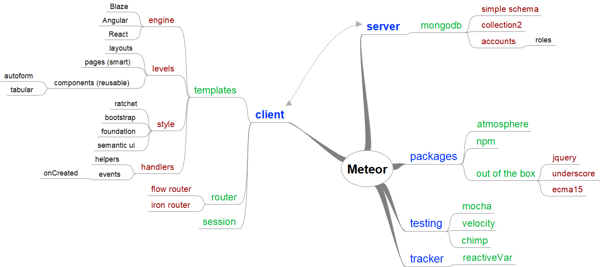

<h1>Meteor overview and major packages</h1>

This repository contains a brief overview of <a href="http://meteor.com">Meteor</a> and an overview of its major packages.

<h2>Overview</h2>

The following features distinguish Meteor from other web-platforms:
<dl>
    <dt>data over the wire</dt><dd>In Meteor client and server exchange data, not HTML.
    <dl>
        <dt>single page app (SPA)</dt><dd>This means that the client is loaded as a whole at start-up and then manages the user interaction without unnecessary calls to the server. This makes for a smooth user-experience.</dd>
        <dt>no REST</dt><dd>This also means that there is not need for REST interfaces, although publish/subscribe (explained below) is similar.</dd>
    </dl></dd>
    <dt>full-stack</dt><dd>In Meteor the functionality on both the server (through node.js) and the client (through the browser) is implemented in Javascript (ES2015+ to be exact). This saves the developer from continuously having to switch between languages.</dd>
    <dt>no SQL</dt><dd>Meteor uses Mongodb as its databackend. Mongodb is document-based and does not use SQL.</dd>
    <dt>reactivity</dt><dd>Data in Meteor is updated everywhere once it changes. This includes all active clients, which adds to the smooth user-experience.</dd>
</dl>

The mindmap below shows how I understand Meteor:

The client handles routing and rendering. Routing is taken care of by Flow router, which uses Blaze as template engine (Angular and React are also supported). Templates are divided in three layers:
<ul>
    <li>layouts define the general structure of your site, using pages</li>
    <li>pages are smart, which means they collect data and feed them to components</li>
    <li>components do not interact with anything except though parameters, which makes them highly reusable</li>
</ul>

Templates can be controlled through helpers and event handlers (including onCreated).

The server uses Mongodb as a datastore. Data is stored in collections, which are basically persistent JSON documents. A schema language is used to define the datastructures, so data can be validated. Schema also drive the autoform package. Collections can be controlled through helpers and hooks.

The client and server communicate through a publish/subscribe mechanism and through methods. The server controls data access by selectively publishing data to the client. The client (pages) collect data through subscriptions. Methods are Meteor's remote procedure calls (RPCs) and can use schema for data validation.

Some final tips & tricks:
<ul>
    <li><tt>waitOn</tt> (package Iron Router) lets you defer execution untill a subscription has finished</li>
    <li>Meteor methods <i>can</i> be called synchronously on the server, but <i>must</i> be called asynchronously  on the client</li>
    <li>Global variables aren't available from templates. Access them with template helper.</li>
    <li>add <tt>c:\Windows\System32</tt> to path on tasklist.exe error</li>
    <li>The autorun function lets you define a function that is run automatically when a reactive data source changes.</li>
    </ul>
</ul>

<h2>Packages</h2>

Just like all other modern frameworks, Meteor relies heavily on third party packages from its thriving eco-system. The Meteor <a href="http://guide.meteor.com">Guide</a> gives an opinionated overview of which packages to use. The table below shows these packages in the middle column, along with some additional packages I prefer in the final column. For more packages visit <a href="https://atmospherejs.com/packages/most-used">Atmosphere js</a>. You can import all these package definitions by importing the file <tt>packages</tt> from this repository into the file <tt>packages</tt> of your project and the remove any package you don't need.

<table id="packages">
<tr><th>subject</th><th>guide</th><th>extra</th></tr>

<tr><td>Out of the box</td>
    <td>
        <li><a href="http://atmospherejs.com/meteor/ecmascript">meteor:ecmascript</a></li>
        <li><a href="https://docs.meteor.com/api/http.html">http</a></li>
        <li><a href="https://docs.meteor.com/packages/jquery.html">jQuery</a></li>
        <li><a href="https://docs.meteor.com/packages/markdown.html">markdown</a></li>
        <li><a href="https://docs.meteor.com/packages/underscore.html">underscore</a></li>
    </td><td>
    </td>
</tr>
<tr><td>Collections</td><td>
    <li><a href="http://atmospherejs.com/aldeed/collection2">aldeed:collection2</a></li>
    <li><a href="http://atmospherejs.com/aldeed/simple-schema">aldeed:simple-schema</a> (or <a href="http://atmospherejs.com/jagi/astronomy">jagi:astronomy</a>)</li>
    <li><a href="http://atmospherejs.com/dburles/collection-helpers">dburles:collection-helpers</a></li>
    <li><a href="http://atmospherejs.com/percolate/migrations">percolate:migrations</a></li>
    </td><td>
    </td>
</tr>
<tr><td>Data-loading</td><td>
<li><a href="http://atmospherejs.com/percolate/find-from-publication">percolate:find-from-publication</a></li>
<li><a href="http://atmospherejs.com/reywood/publish-composite">reywood:publish-composite</a></li>
<li><a href="http://atmospherejs.com/simple/rest">simple:rest</a></li>
<li><a href="http://atmospherejs.com/tmeasday/publish-counts">tmeasday:publish-counts</a></li>
</td><td>
</td></tr>
<tr><td>Methods</td><td>
<li><a href="https://atmospherejs.com/mdg/validated-method">mdg:validated-method</a></li>
</td><td>
</td></tr>
<tr><td>User accounts</td><td>
<li><a href="http://atmospherejs.com/alanning/roles">alanning:roles</a></li>
<li><a href="http://atmospherejs.com/arillo/flow-router-helpers">arillo:flow-router-helpers</a></li>
<li><a href="http://atmospherejs.com/useraccounts/flow-routing">useraccounts:flow-routing</a></li>
<li><a href="http://atmospherejs.com/useraccounts/core">useraccounts:core</a></li>
<li><a href="http://atmospherejs.com/useraccounts/unstyled">useraccounts:unstyled</a></li>
</td><td>
<li><a href="http://atmospherejs.com/didericis/permissions-mixin">didericis:permissions-mixin</a></li>
<li><a href="http://atmospherejs.com/matb33/collection-hooks">matb33:collection-hooks</a></li>
<li><a href="http://atmospherejs.com/ongoworks/security">ongoworks:security</a></li>
<li><a href="http://atmospherejs.com/ostrio/user-status">ostrio:user-status</a> (or <a href="http://atmospherejs.com/tmeasday/presence">tmeasday:presence</a>)</li>
</td></tr>
<tr><td>Routing</td><td>
<li><a href="http://atmospherejs.com/arillo/flow-router-helpers">arillo:flow-router-helpers</a></li>
<li><a href="http://atmospherejs.com/kadira/flow-router">kadira:flow-router</a></li>
<li><a href="http://atmospherejs.com/nimble/restivus">nimble:restivus</a></li>
<li><a href="http://atmospherejs.com/zimme/active-route">zimme:active-route</a></li>
</td><td>
<li><a href="http://atmospherejs.com/ostrio/flow-router-extra">ostrio:flow-router-extra</a></li>
</td></tr>
<tr><td>UI-UX</td><td>
<li><a href="http://atmospherejs.com/aldeed/autoform">aldeed:autoform</a></li>
<li><a href="http://atmospherejs.com/percolate/momentum">percolate:momentum</a></li>
<li><a href="http://atmospherejs.com/tap/i18n">tap:i18n</a> (or <a href="http://atmospherejs.com/universe/18n">universe:18n</a>)</li>
</td><td>
<li><a href="http://atmospherejs.com/aldeed/tabular">aldeed:tabular</a></li>
<li><a href="http://atmospherejs.com/aldeed/template-extension">aldeed:template-extension</a></li>
<li><a href="http://atmospherejs.com/raix/push">raix:push</a></li>
<li><a href="http://atmospherejs.com/aslagle/reactive-table">aslagle:reactive-table</a></li>
<li><a href="http://atmospherejs.com/semantic/ui">semantic:ui</a></li>
<li><a href="http://atmospherejs.com/twbs/bootstrap">twbs:bootstrap</a></li>
<li><a href="http://atmospherejs.com/chrismbeckett/toastr">chrismbeckett:toastr</a></li>
<li><a href="http://atmospherejs.com/matb33:bootstrap-glyphicons">matb33:bootstrap-glyphicons</a></li>
</td></tr>
<tr><td>Other</td><td>
</td><td>
<li><a href="http://atmospherejs.com/dburles/google-maps">dburles:google-maps</a></li>
<li><a href="http://atmospherejs.com/easy/search">easy:search</a></li>
<li><a href="http://atmospherejs.com/momentjs/moment">momentjs:moment</a></li>
<li><a href="http://atmospherejs.com/sach/flow-db-admin">sach:flow-db-admin</a></li>
<li></li>
</td></tr>
<tr><td>Testing</td><td>
<li><a href="http://atmospherejs.com/dburles/factory">dburles:factory</a></li>
<li><a href="http://atmospherejs.com/hwillson/stub-collections">hwillson:stub-collections</a></li>
<li><a href="http://atmospherejs.com/johanbrook/publication-collector">johanbrook:publication-collector</a></li>
<li><a href="http://atmospherejs.com/meteortesting/mocha">meteortesting:mocha</a></li>
<li><a href="http://atmospherejs.com/practicalmeteor/mocha">practicalmeteor:mocha</a></li>
<li><a href="http://atmospherejs.com/velocity/meteor-stubs">velocity:meteor-stubs</a></li>
<li><a href="http://atmospherejs.com/xolvio/cleaner">xolvio:cleaner</a></li>
</td><td>
<li><a href="https://chimp.readme.io/">Chimp</a> (not really a package)</li>
</td></tr>
<tr><td>Deployment</td><td>
<li><a href="http://atmospherejs.com/dferber/prerender">dferber:prerender</a></li>
<li><a href="http://atmospherejs.com/kadira/dochead">kadira:dochead</a></li>
<li><a href="http://atmospherejs.com/mdg/seo">mdg:seo</a></li>
<li><a href="http://atmospherejs.com/okgrow/analytics">okgrow:analytics</a></li>
</td><td>
</td></tr>
</table>